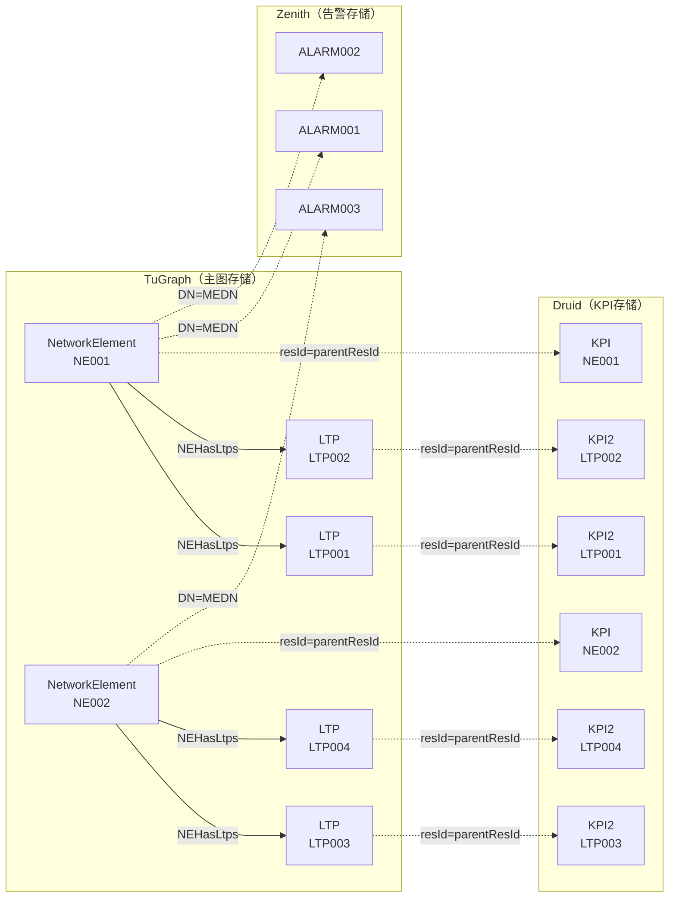
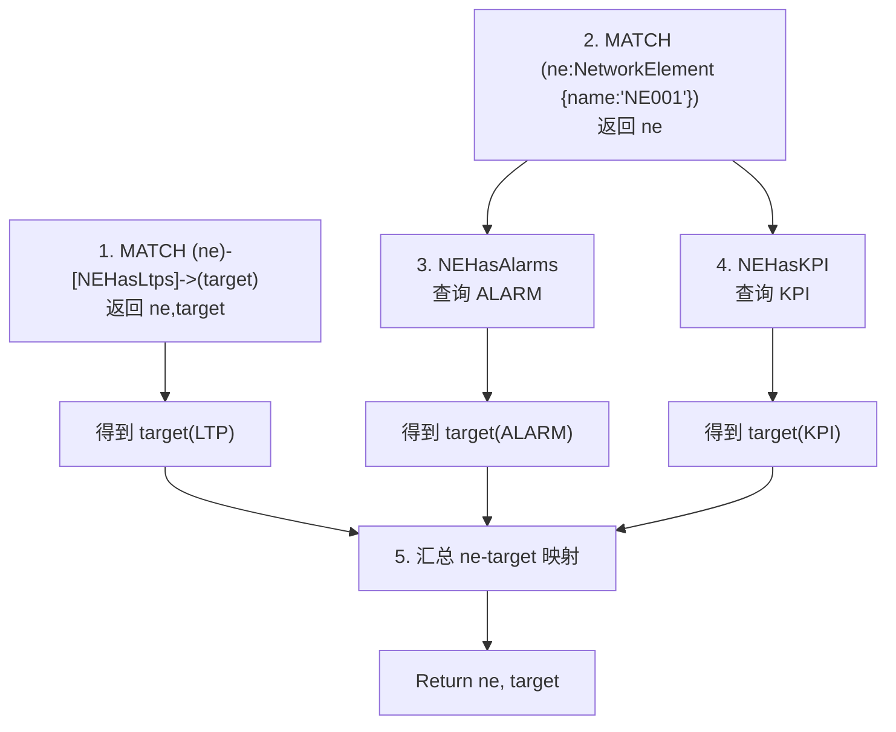
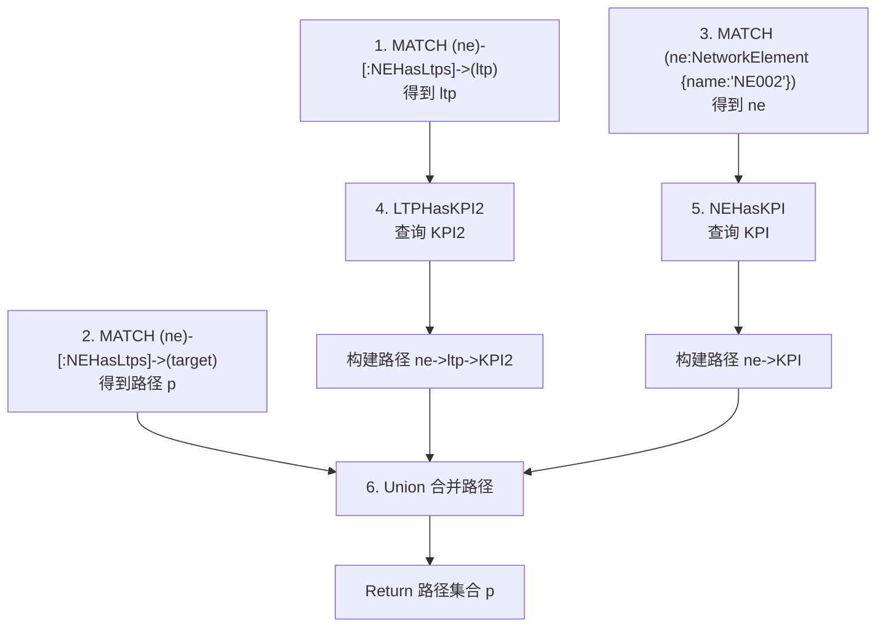
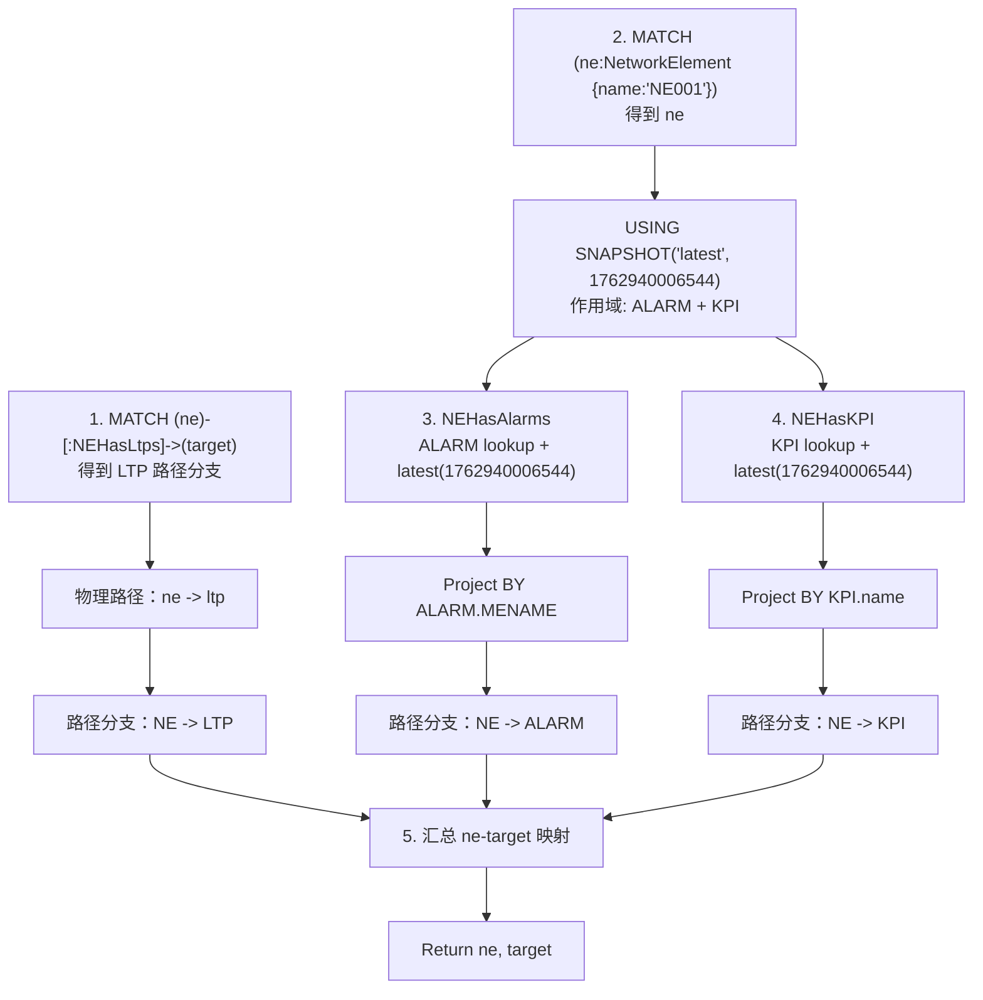

# Virtual Graph Case

## label description

| 类型     | Label          | 存储位置    | 标签/标记    | 说明                                           |
| ------ | -------------- | ------- | -------- | -------------------------------------------- |
| Vertex | NetworkElement | tugraph | -        | 网络中的物理设备                                     |
| Vertex | LTP            | tugraph | -        | `NetworkElement` 内部逻辑组件，`parentResId` 指向父 NE |
| Vertex | KPI            | Druid   | external | `NetworkElement` 的性能指标数据                     |
| Vertex | KPI2           | Druid   | external | `LTP` 的性能指标数据                                |
| Vertex | ALARM          | Zenith  | external | 设备告警数据                                       |
| Edge   | NEHasAlarms    | -       | 虚拟边      | `NetworkElement.DN = ALARM.MEDN`             |
| Edge   | NEHasKPI       | -       | 虚拟边      | `NetworkElement.resId = KPI.parentResId`     |
| Edge   | LTPHasKPI2     | -       | 虚拟边      | `LTP.resId = KPI2.parentResId`               |
| Edge   | NEHasLtps      | tugraph | 物理边      | NE 与 LTP 的拥有关系                               |

## Schema 

| 类型     | Label          | 主键    | 属性 (Properties)                                                                                                          |
| ------ | -------------- | ----- |--------------------------------------------------------------------------------------------------------------------------|
| Vertex | NetworkElement | resId | `resId` (STRING, 非空)<br/>`DN` (STRING, 非空)<br/>`name` (STRING, 非空)                                                       |
| Vertex | LTP            | resId | `resId` (STRING, 非空)<br/>`name` (STRING, 非空)<br/>`parentResId` (STRING, 非空)                                              |
| Vertex | KPI            | id    | `id` (STRING, 非空)<br/>`name` (STRING, 非空)<br/>`parentResId` (STRING, 非空) <br/>`time` (INT64, 非空)                        |
| Vertex | KPI2           | id    | `id` (STRING, 非空)<br/>`name` (STRING, 非空)<br/>`parentResId` (STRING, 非空) <br/>`time` (INT64, 非空)                        |
| Vertex | ALARM          | CSN   | `CSN` (STRING, 非空)<br/>`MEDN` (STRING, 非空)<br/>`MENAME` (STRING, 非空)<br/>`OCCURTIME` (INT64, 非空)<br/>`CLEARTIME` (INT64, 非空) |
| Edge   | NEHasAlarms    | -     | N/A                                                                                                                      |
| Edge   | NEHasKPI       | -     | N/A                                                                                                                      |
| Edge   | LTPHasKPI2     | -     | N/A                                                                                                                      |
| Edge   | NEHasLtps      | -     | N/A                                                                                                                      |

## Data Construction

数据依赖图如下所示：


具体的数据内容如下：
NetworkElement数据：
```txt
CREATE (ne:NetworkElement {resId: 'eccc2c94-6a31-45ea-a16e-0c709939cbe5', name: 'NE001', DN: '388581df-50a3-4d9f-96d4-15faf36f9caf'})
CREATE (ne:NetworkElement {resId: '552dddad-84c4-4d5e-9014-481443ec23b5', name: 'NE002', DN: 'a158b427-4a65-4adf-9096-3c8225519cca'})
```

LTP数据：
```txt
CREATE (ltp:LTP {resId: 'db82ad76-8bdc-4f4b-96a0-a5e91c6861fb', name: 'LTP001', parentResId: 'eccc2c94-6a31-45ea-a16e-0c709939cbe5'})
CREATE (ltp:LTP {resId: 'c889973b-8bd7-4eb9-899b-b1cc9bf18a2e', name: 'LTP002', parentResId: 'eccc2c94-6a31-45ea-a16e-0c709939cbe5'})
CREATE (ltp:LTP {resId: '537ae2db-80d6-4b13-9cee-140a9af811ca', name: 'LTP003', parentResId: '552dddad-84c4-4d5e-9014-481443ec23b5'})
CREATE (ltp:LTP {resId: '7c013137-db19-4f21-bbbd-6908cd2033d8', name: 'LTP004', parentResId: '552dddad-84c4-4d5e-9014-481443ec23b5'})
```

KPI数据：
网元NE001对应的KPI数据:
```json
{"resId": "0079bb0f-0e0a-44de-b595-cab5c22324ef", "name": "KPI001", "parentResId": "eccc2c94-6a31-45ea-a16e-0c709939cbe5", "time": 1775825156755}
```
网元NE002对应的KPI数据:
```json
{"resId": "5af68cc1-3fad-486e-8073-cb0d1181a3e4", "name": "KPI001", "parentResId": "552dddad-84c4-4d5e-9014-481443ec23b5", "time": 1775825856755}
```

KPI数据：
LTP001对应的KPI2数据:
```json
{"resId": "90d7f2d4-4822-438e-a0cd-b2e7011e9786", "name": "KPI2001", "parentResId": "db82ad76-8bdc-4f4b-96a0-a5e91c6861fb", "time": 1775825256755}
```
LTP002对应的KPI2数据:
```json
{"resId": "5ff8f0f4-77a3-403d-889a-d615b4fd586a", "name": "KPI2002", "parentResId": "c889973b-8bd7-4eb9-899b-b1cc9bf18a2e", "time": 1775825556755}
```
LTP003对应的KPI2数据:
```json
{"resId": "0036d5a5-ae90-4c76-98d8-113c616d9e8d", "name": "KPI2003", "parentResId": "537ae2db-80d6-4b13-9cee-140a9af811ca", "time": 1775822856755}
```
LTP004对应的KPI2数据:
```json
{"resId": "d53fcfab-d0cb-4fe5-84a9-73de0f0b2850", "name": "KPI2004", "parentResId": "7c013137-db19-4f21-bbbd-6908cd2033d8", "time": 1775825951299}
```

ALARM数据：
网元NE001对应的ALARM数据:
```json
{"CSN": "0079bb0f-0e0a-44de-b595-cab5c22324ef", "MENAME": "ALARM001", "MEDN": "388581df-50a3-4d9f-96d4-15faf36f9caf", "OCCURTIME": 1775825151299, "CLEARTIME": 1775825951299}
```
```json
{"CSN": "afa87ad3-0834-467c-ba2e-1315fb9ba0cb", "MENAME": "ALARM002", "MEDN": "388581df-50a3-4d9f-96d4-15faf36f9caf", "OCCURTIME": 1775825251299, "CLEARTIME": 1775825551299}
```

网元NE002对应的ALARM数据:
```json
{"CSN": "0148b488-f857-40a3-8e85-7b5ecf16f6ac", "MENAME": "ALARM003", "MEDN": "a158b427-4a65-4adf-9096-3c8225519cca", "OCCURTIME": 1775825151299, "CLEARTIME": 1775825951299}
```


## User Case

### Case1

语句：MATCH (ne:NetworkElement {name: 'NE001'})-[r:NEHasLtps|NEHasAlarms|NEHasKPI]->(target) return ne,target; 
执行过程： 
1.MATCH (ne:NetworkElement {name: 'NE001'})-[r:NEHasLtps]->(target) return ne,target; 
2.MATCH (ne:NetworkElement {name: 'NE001'}) return ne; 
3.通过ne的虚拟边NEHasAlarms去查询AlARM，得到target 
4.通过ne的虚拟边NEHasKPI去查询KPI，得到target 
5.汇总ne和target的映射； 
其中1和2可以并行，3和4必须依赖2的输出，5依赖1、3和4的输出；



### Case2

语句：match p=(ne:NetworkElement {name: 'NE002'})-[:NEHasLtps]->(ltp)-[:LTPHasKPI2]->(target) return p union MATCH p = (ne:NetworkElement {name: 'NE002'})-[:NEHasLtps|NEHasKPI]->(target) return p; 
执行过程： 
1. MATCH p=(ne:NetworkElement {name: 'NE002'})-[:NEHasLtps]->(ltp)得到Ltp； 
2. MATCH p = (ne:NetworkElement {name: 'NE002'})-[:NEHasLtps]->(target) return p; 得到p 
3. MATCH p = (ne:NetworkElement {name: 'NE002'}) 得到ne； 
4. 根据Ltp的虚拟边LTPHasKPI2查询得到KPI2，得到从ne到ltp到KPI2的路径； 
5. 根据ne的虚拟边NEHasKPI查询得到KPI，得到从ne到KPI的路径； 
6. 将2、4、5三个步骤得到的路径进行合并，得到最终的路径集合； 
其中1，2，3可并发执行，4，5可以并发执行，4依赖1的输出，5依赖3的输出，6依赖2，4，5的输出；



### Case3

语句：USING SNAPSHOT('latest', 1762940006544) ON ['ALARM'，'KPI'] MATCH (ne:NetworkElement {name: 'NE001'})-[:NEHasLtps|NEHasAlarms|NEHasKPI]->(target) RETURN ne,target; PROJECT BY {'ALARM': ['MENAME'], 'KPI': ['name']} 

| 对齐方法     | 说明                                             | 策略                                      |
|--------------|--------------------------------------------------|-------------------------------------------|
| 最近邻对齐   | 将每个目标时间点映射到最近的原始数据点，时间可前可后 | nnAlign (nearest-neighbour alignment)，`nearest` |
| 前向填充     | 用前一个有效值填充缺失时间点，时间只可向前         | ffill (forward fill)，默认策略 `latest`         |

执行过程： 
1.MATCH (ne:NetworkElement {name: 'NE001'})-[r:NEHasLtps]->(target) return ne,target; 
2.MATCH (ne:NetworkElement {name: 'NE001'}) return ne; 
3.通过ne的虚拟边NEHasAlarms去查询AlARM，新增时间条件，类别为latest，值为1762940006544，同时增加返回投影字段MENAME，得到target 
4.通过ne的虚拟边NEHasKPI去查询KPI，新增时间条件，类别为latest，值为1762940006544，同时增加返回投影字段name，得到target 
5.汇总ne和target的映射；



### Case4

match (alarm:Alarm {name: 'ALARM001'}) where alarm.CSN='0079bb0f-0e0a-44de-b595-cab5c22324ef';

执行过程：
1. 执行接口请求，alarm接口过滤条件存在name为ALARM001，CSN为0079bb0f-0e0a-44de-b595-cab5c22324ef;

### Case5

match (alarm:Alarm {name: 'ALARM002'})-[r1:NEHasAlarms]<-(ne) return ne where alarm.CSN='afa87ad3-0834-467c-ba2e-1315fb9ba0cb';

执行过程：
1. 执行接口请求，alarm接口过滤条件存在name为ALARM002，CSN为afa87ad3-0834-467c-ba2e-1315fb9ba0cb;
2. 然后根据alarm的DN数据去关联虚拟边去查询网元，match (ne:NetworkElement) return ne where ne.resId='xxx', xxx为第一步查询到的alarm的DN；

