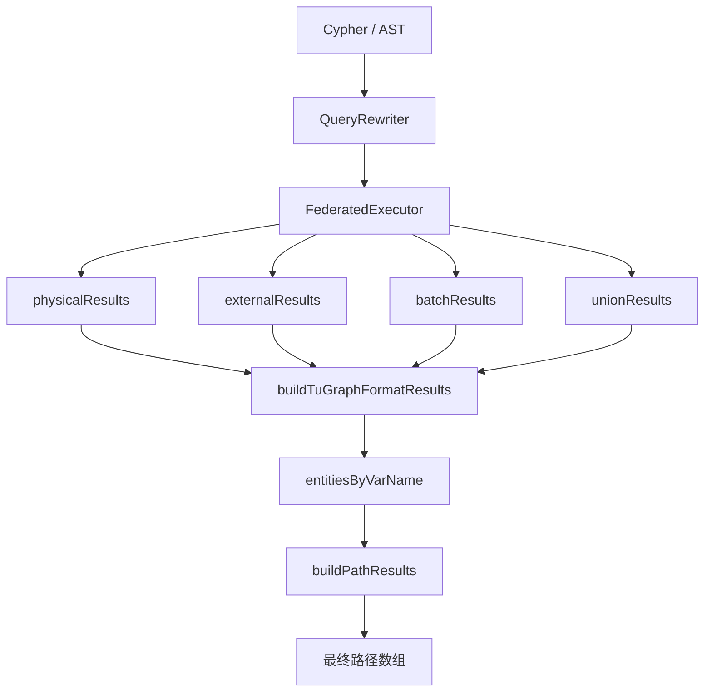
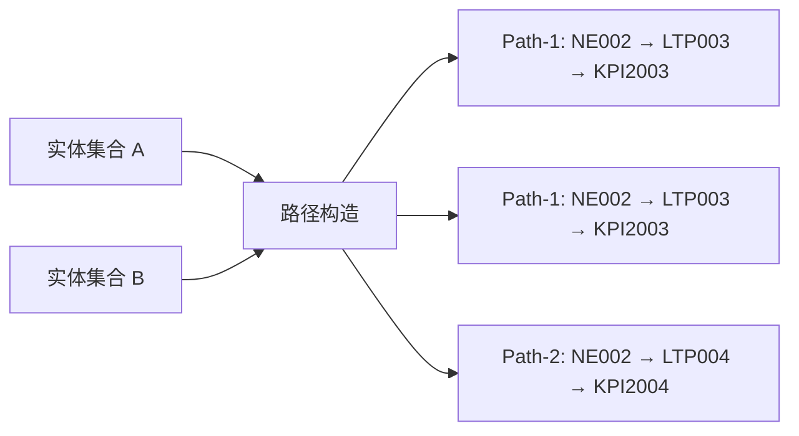
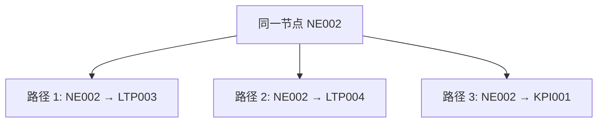
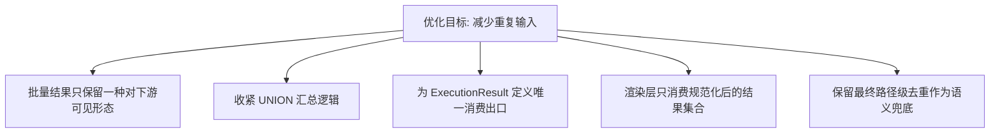

# 路径去重原理说明

**文档日期**: 2026-04-12  
**适用范围**: `RETURN p`、`UNION`、虚拟边、批量外部查询  
**关联实现**: `GraphQuerySDK`、`FederatedExecutor`、`ExecutionResult`

---

## 一、问题背景

在路径查询场景中，执行器当前输出的不是“路径”，而是多个来源的实体集合：

- `physicalResults`
- `externalResults`
- `batchResults`
- `unionResults`

这些实体会在 `GraphQuerySDK.buildTuGraphFormatResults` 中按变量名重新归并，再由 `buildPathResults` 递归拼装为最终路径。

因此，重复问题分为两层：

- **实体级重复**：同一实体被执行链路重复保存、重复汇总
- **路径级重复**：不同来源的实体最终拼出完全相同的路径

---

## 二、为什么不能只在执行端去重

### 2.1 执行端看到的是实体，不是路径

执行器只知道某个变量下有哪些 `GraphEntity`，但不知道：

- 它最终会接到哪一条路径分支上
- 它与当前路径末节点是否真正可连接
- 两组实体最终是否会拼成同一条路径

因此执行端最多能做**实体规范化**，无法独立完成**路径等价判定**。

### 2.2 路径是否重复，要等路径成型后才能判断

例如两个子查询可能各自产生一组实体，单看实体集合不同，但最终构造出的路径文本完全一致。  
这种情况只有在路径完整展开后，才能确定应当合并为 1 条结果。

---

## 三、执行链路与重复来源

### 3.1 已知的执行侧重复来源

- 批量查询结果先写入 `batchResults`
- 同一批结果再经过 `unbatch` 写入 `externalResults`
- `UNION` 汇总时再次把子计划中的实体扁平拷贝到 `unionResults`
- 最终渲染层同时消费多个结果桶，导致重复实体再次进入路径构造

---

## 四、为什么最终仍要保留路径去重

上图说明：

- 不同来源的实体集合可能在最终拼装后得到同一条路径
- 执行端无法提前知道 `R1` 与 `R2` 是同一条路径
- 只有在 `buildPathResults` 形成完整 path 后，才能对路径本身进行去重

因此最终层必须承担两件事：

- 对参与路径拼装的实体先做一次规范化去重
- 对生成后的完整路径再做一次路径级去重

---

## 五、执行端为什么无法“完全”去重

这里的 `NE002` 在三条路径中都合法出现。

如果执行端简单按实体 ID 全局去重，只保留一次实体出现信息，会丢失：

- 节点在不同路径中的合法复用
- 同一终点在不同父节点下的连接语义
- 虚拟边基于 `parentResId` 与当前路径末节点的挂接关系

所以执行端只能去掉**工程性重复**，不能消掉**路径语义上的重复出现**。

---

## 六、当前合理的职责边界

### 6.1 执行端负责

- 避免同一批结果同时以多种形式暴露给下游
- 避免 `UNION` 对同源实体做重复汇总
- 尽量减少无意义的实体重复进入渲染层

### 6.2 路径构造端负责

- 根据当前路径上下文判断实体是否真的可连接
- 按完整路径内容判断两条 path 是否等价
- 对最终输出的路径数组进行去重

---

## 七、可做的优化点

建议按以下顺序优化：

1. **批量结果单出口**  
   不再让 `batchResults` 与 `externalResults` 同时参与最终渲染。

2. **UNION 汇总收紧**  
   避免把子计划中的多来源实体无差别再次扁平复制。

3. **ExecutionResult 结果语义收敛**  
   明确哪些结果桶是“内部中间态”，哪些结果桶才允许进入最终结果构造。

4. **保留最终路径去重**  
   即使执行端已优化，路径层仍应保留最终去重，作为路径语义正确性的最后保障。

---

## 八、结论

- 在当前架构下，**只靠执行端无法完全消除路径重复**
- 执行端可以减少实体级重复，但不能替代路径级判等
- 在 `buildPathResults` 中保留最终路径去重是必要且合理的
- 最优方案不是“只在一端去重”，而是：
  - **执行端减少工程性重复**
  - **路径构造端完成最终语义去重**

---

## 九、相关文件

- `src/main/java/com/federatedquery/executor/ExecutionResult.java`
- `src/main/java/com/federatedquery/executor/FederatedExecutor.java`
- `src/main/java/com/federatedquery/executor/BatchingStrategy.java`
- `src/main/java/com/federatedquery/sdk/GraphQuerySDK.java`
- `src/test/java/com/federatedquery/e2e/VirtualGraphCaseE2ETest.java`
